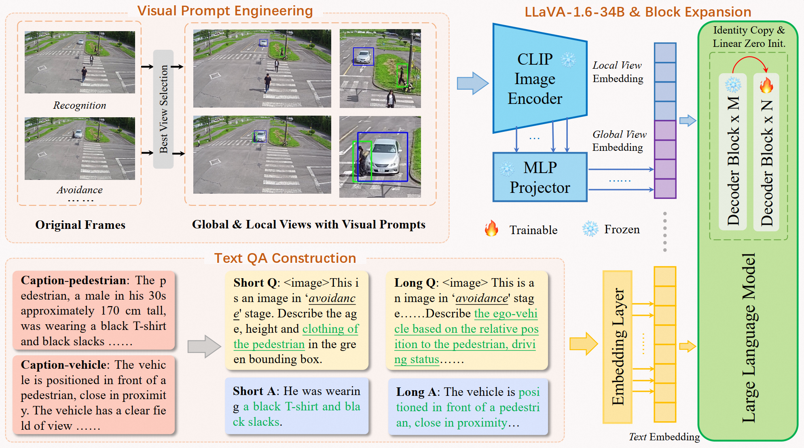

# AICITY2024_Track2_AliOpenTrek_CityLLaVA

🏆 **The 1st Place** Solution to The 8th NVIDIA AI City Challenge (CVPR 2024 workshop) Track 2: [CityLLaVA: Efficient Fine-Tuning for VLMs in City Scenario](https://arxiv.org/abs/2405.03194).



## Leaderboard

|     **TeamName**     | **MRR Score** | **Rank** |
| :-------------------------: | :-----------------: | :------------: |
| **AliOpenTrek(Ours)** |  **33.4308**  |  **1**  |
|           AIO_ISC           |       32.8877       |       2       |
|         Lighthouse         |       32.3006       |       3       |

## Prepare

1. Install Package

```Shell
conda create -n cityllava python=3.10 -y
conda activate cityllava
cd AICITY2024_Track2_AliOpenTrek_CityLLaVA/
pip install --upgrade pip  # enable PEP 660 support
pip install -e .
pip install flash-attn --no-build-isolation
```

## structures

### Data Preparation

Firstly change the directory to `data_preprocess` and create the `data` directory.

```
cd data_preprocess
mkdir ./data
```

Please download the [wts-dataset](https://github.com/woven-visionai/wts-dataset). Then, put the datasets under `./data`. After unzip the datasets, the directory structure should be like this:

```
.
├── data
│   ├── BDD_PC_5k
│   │   ├── annotations
│   │   │   ├── bbox_annotated
│   │   │   ├── bbox_generated
│   │   │   └── caption
│   │   └── videos
│   ├── WTS
│   │   ├── annotations
│   │   │   ├── bbox_annotated
│   │   │   ├── bbox_generated
│   │   │   └── caption
│   │   └── videos
│   └── test_part
|       ├── view_used_as_main_reference_for_multiview_scenario.csv
│       ├── WTS_DATASET_PUBLIC_TEST
│       └── WTS_DATASET_PUBLIC_TEST_BBOX
└── ... # python and shell scripts
```

Then run the following script to process the test data:

```
bash prepare_data_test.sh
```
After this script is excuted, all the test data is prepared. You can download the fintuned model and run the inference step directly.

Run the following script to process the train data:

```
bash prepare_data_train.sh
```
<b>Note</b> that the Openai or Qwen API is required in "prepare_data_train.sh". You should modify the API_KEY in this script.

After the execution, the folder structure should be like this:

```
.
├── data
│   ├── BDD_PC_5k
│   │   ├── annotations
│   │   │   ├── bbox_annotated
│   │   │   ├── bbox_generated
│   │   │   └── caption
│   │   ├── bbox_global # BDD global views
│   │   │   ├── train
│   │   │   └── val
│   │   ├── bbox_local # BDD local views
│   │   │   ├── train
│   │   │   └── val
│   │   └── videos
│   ├── WTS
│   │   ├── annotations
│   │   │   ├── bbox_annotated
│   │   │   ├── bbox_generated
│   │   │   └── caption
│   │   ├── bbox_global # WTS global views
│   │   │   ├── train
│   │   │   └── val
│   │   ├── bbox_local # BDD local views
│   │   │   ├── train
│   │   │   └── val
│   │   └── videos
│   └── test_part
|       ├── view_used_as_main_reference_for_multiview_scenario.csv
│       ├── WTS_DATASET_PUBLIC_TEST
│       │   ├──bbox_global/test/public # WTS Test Images
│       │   ├──bbox_local/test/public
│       │   └──external/BDD_PC_5K
│       │       ├──bbox_global/test/public # BDD Test Images
│       │       └──bbox_local/test/public
│       └── WTS_DATASET_PUBLIC_TEST_BBOX
├── processed_anno
│   ├── frame_bbox_anno
│   │   ├── bdd_test_all_video_with_bbox_anno_first_frame.json
│   │   ├── bdd_train_all_video_with_bbox_anno_first_frame.json
│   │   ├── bdd_val_all_video_with_bbox_anno_first_frame.json
│   │   ├── wts_test_all_video_with_bbox_anno_first_frame.json
│   │   ├── wts_train_all_video_with_bbox_anno_first_frame.json
│   │   └── wts_val_all_video_with_bbox_anno_first_frame.json
│   ├── llava_format
│   │   ├── wts_bdd_train.json
│   │   └── wts_bdd_val.json
│   ├──best_view_for_test.json
│   └──perspective_test_images.json
└── ... # python and shell scripts
```

Then the processed annotations could be found under `./processed_anno`, and the train json is:

```
'./data/processed_anno/llava_format/wts_bdd_llava_qa_train_stage_filted_checked.json'
```

## Block-Expansion

We use the block expansion to fine-tune the VLMs. 8~16 blocks are suggested for balancing the  performance and efficiency. We add 12 blcoks to the original llava-1.6-34b. the llava-1.6-34b-12block model could be created by these steps:

1. Download the [llava-1.6-34b](https://huggingface.co/liuhaotian/llava-v1.6-34b) model to `./models`, and add block with this script:

```
   python block_expansion_llava_1_6.py
```

2. Copy the `*.json` and `tokenizer.model` form `./models/llava-v1.6-34b` to `./models/llava-v1.6-34b-12block`;
3. Modify the `num_hidden_layers=72` (new_layer_nums= original_layer_nums+block_layer_nums) in `config.json` of the llava-1.6-34b-12block model.

## Train

We use 8xA100 GPUs for fine-tuning. The training process takes approximately 8 hours by this script:

```
bash scripts/finetune_block_bigsmall.sh
```

The fine-tuned model could be download [here](https://modelscope.cn/models/AliOpenTrek/CityLLaVA).

## Inference

Firstly, you should check the parameters defined at `./scripts/inference.sh`, ensure that all essential files and model exist.

Now you can do inference on WTS_TEST_SET:

```
bash scripts/inference.sh
```

## Evaluation

We use the [wts-dataset](https://github.com/woven-visionai/wts-dataset) for evaluation.

## Citation

If you find CityLLaVA useful for your research and applications, please cite using this BibTeX:

```bibtex
@misc{duan2024cityllava,
    title={CityLLaVA: Efficient Fine-Tuning for VLMs in City Scenario},
    url={https://github.com/qingchunlizhi/AICITY2024_Track2_AliOpenTrek_CityLLaVA},
    author={Zhizhao Duan, Hao Cheng, Duo Xu, Xi Wu, Xiangxie Zhang, Xi Ye, and Zhen Xie},
    year={2024},
    eprint={2405.03194},
    archivePrefix={arXiv},
    primaryClass={cs.CV}
}
```

## Acknowledgement

- CityLLaVA is built with reference to the code of the following projects: [LLaVA](https://github.com/haotian-liu/LLaVA) and [LLaMA-Pro](https://github.com/TencentARC/LLaMA-Pro.git). Thanks for their awesome work!
